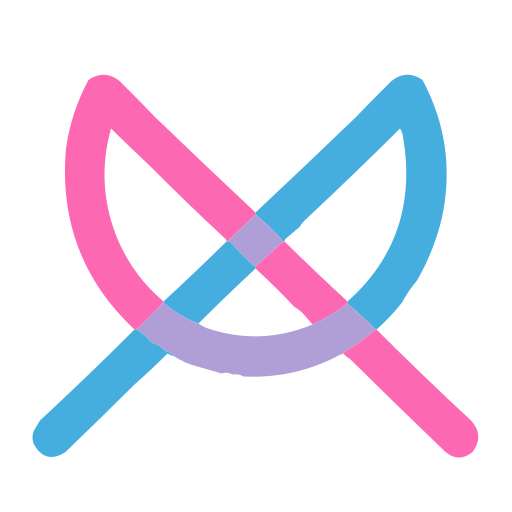

<div class="hero">
  
  <h1>NLC for Kodi</h1>
  <p class="tagline">
    Decentralized communication and media sharing — text, voice, video, and file transfer — built into Kodi's native interface.
  </p>
</div>

<div class="early-dev-warning">
  🚧 <strong>Early Development</strong> — This add-on is not yet published. The documentation reflects planned and in-progress features.
</div>

---

## What Is This?

**kodi-addon-nolimitconnect** is a Kodi binary add-on that embeds the [NoLimitConnect](https://nolimitconnect.org) peer-to-peer platform inside Kodi. Seven NLC communication plugins are exposed as first-class Kodi features — no separate app needed, no account, no ads, no server to trust.

The add-on connects to the `nolimitconnect.net` network upon first launch, allowing users to find and communicate with peers across the NLC network directly from their media center.

---

## Plugins

<div class="plugin-grid">

<div class="plugin-card">
  <span class="slot-badge">SLOT 8</span>
  <h3>💬 Messenger</h3>
  Text, voice, and video messaging within a session. Supports inline media and emoji.
  <br><a href="plugins/messenger/">Learn more →</a>
</div>

<div class="plugin-card">
  <span class="slot-badge">SLOT 9</span>
  <h3>🎙️ Push To Talk</h3>
  VOIP push-to-talk audio over Opus codec with WebRTC AEC and RNNoise suppression.
  <br><a href="plugins/push-to-talk/">Learn more →</a>
</div>

<div class="plugin-card">
  <span class="slot-badge">SLOT 10</span>
  <h3>📁 Person File Xfer</h3>
  Direct peer-to-peer file transfer — no cloud, no intermediary storage.
  <br><a href="plugins/person-file-xfer/">Learn more →</a>
</div>

<div class="plugin-card">
  <span class="slot-badge">SLOT 11</span>
  <h3>📷 Cam Server</h3>
  Broadcast your webcam as an MJPEG stream to network peers.
  <br><a href="plugins/cam-server/">Learn more →</a>
</div>

<div class="plugin-card">
  <span class="slot-badge">SLOT 12</span>
  <h3>📂 File Share Server</h3>
  Share a local media library with peers and serve it as a streamable media source for Kodi.
  <br><a href="plugins/file-share-server/">Learn more →</a>
</div>

<div class="plugin-card">
  <span class="slot-badge">SLOT 15</span>
  <h3>🎥 Video Chat</h3>
  Full video chat with motion detection and session recording.
  <br><a href="plugins/video-chat/">Learn more →</a>
</div>

<div class="plugin-card">
  <span class="slot-badge">SLOT 16</span>
  <h3>📞 Voice Phone</h3>
  VOIP audio-only phone call. Crystal-clear Opus audio with echo cancellation.
  <br><a href="plugins/voice-phone/">Learn more →</a>
</div>

</div>

---

## Quick Start

```bash
git clone https://github.com/nolimitconnect/kodi-addon-nolimitconnect.git
cd kodi-addon-nolimitconnect
cmake -B build -DKODI_SOURCE_DIR=/path/to/kodi-source -DKODI_BUILD_DIR=/path/to/kodi/build
cmake --build build -j$(nproc)
```

→ Full instructions: [Building the Add-on](developer-docs/building.md)

---

## Further Reading

- [Overview](overview.md) — How the add-on works, sign-on flow, and architecture
- [Plugin Reference](plugins/index.md) — All seven plugins in detail
- [Developer Docs](developer-docs/index.md) — Architecture, build system, and contribution guide
- [NoLimitConnect project](https://nolimitconnect.org) — The upstream desktop application
